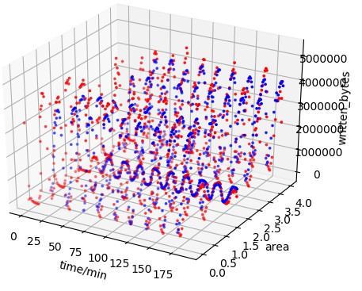
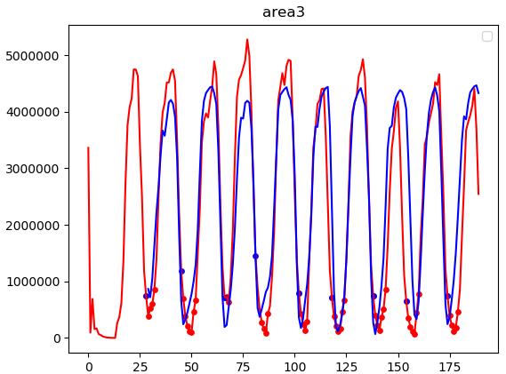

## TiNet
A model for predicting hot and cold data

## Dataset

### Signle Update

### Multiple Update

### Multiple Append Write

## Result

### Multiple Update

### TODO

- Combine k8s
- Better model

