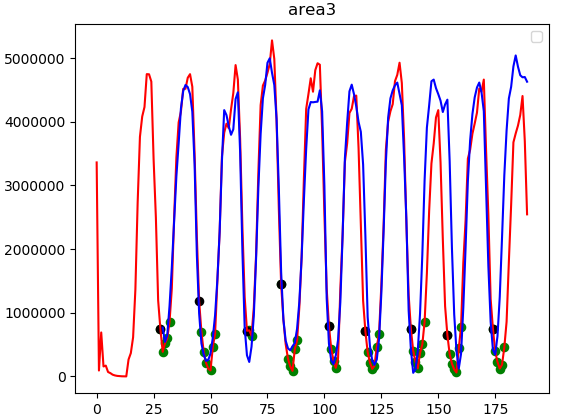

## TiNet
A model for predicting hot and cold data

## Dataset

### Single Update

### Multiple Update

### Multiple Append Write

## Result

### single Update

平均绝对误差（mae）/Byte:[455162   83103]
R2_score(预测值与真实值接近程度，最大为1):[0.878  0.960]
### Multiple Update

红色线为真实值，蓝色线为预测值，横轴为时间（分钟），
通过前20分钟曲线预测10分钟之后的时刻的写比特。
其中点代表集群调度时间，选择在实际负载低的时候进行region调度。绿色点代表将未来临近时间负载高的region调度到高性能机器上，
黑色点代表此时可以从高性能机器上将region调出。
### TODO

- Combine k8s
- Better model

